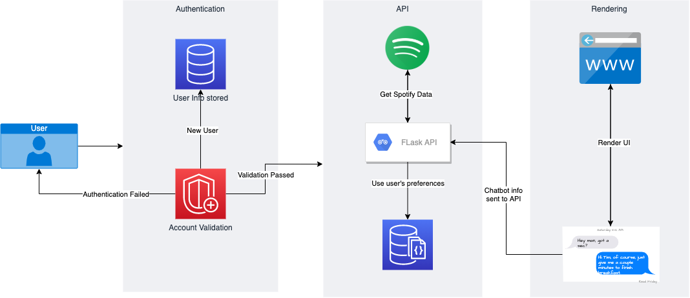

# Musique
Music Recommendation Made Simple      
[](https://github.com/collinsnji/musique/actions/workflows/ci.yml)

# About this project
This project is the semester project for CS 346 - Software Engineering at Mount St. Mary's University. The idea behind this project is to put the user at the center of their music recommendation.    

Music as a service has increased in popularity in the last decade with the introduction of streaming services. However, music recommendation still highly depends on the user's behavior to generate these recommendations. However, these are often inaccurate, and not as fine-tuned as the user may need. This is where Musique comes into play.      

Musique uses the user's input (including genre, dance mode, and song key), along with the user's listening habits to generate music recommendations tailored to the user's taste and style. This puts the user at the for

# Project Setup
This project uses a combination of different technologies and programming paradigms to accomplish the goal. Below is a quick layout of the project components     



### Step by Step Setup
> Note: This project requires `Python 3.8`, `pip3`, and (optionally) the latest `venv` module to run. See the Python Download Guide (https://wiki.python.org/moin/BeginnersGuide/Download) for instructions on how to install Python
1. Clone the repository
   ``` bash
   $ git clone https://github.com/collinsnji/musique.git
   $ cd musique
   ```
2. Create Virtual Environment and Install project dependencies
   ``` bash
   $ # create the virtual environment in ./env
   $ python -m venv env
   
   $ # install project dependencies 
   $ pip install -r requirements.txt
   ```
3. Add API keys
   > Note: This project depends on the `Spotify` and `Google Cloud` APIs to run     
    See: https://cloud.google.com/datastore/docs/quickstart on how to setup a GCP project and obtain the `account credentials` for Datastore.    
    Also See: https://spotipy.readthedocs.io/en/2.19.0/ for instructions on how to obtain a `Spotify client ID` and a `client secret`.     
    Once the Datastore account credentials are obtained along with the Spotify credentials, create a new file in the project root `.env`. Copy the contents of `.env_template` to this file, and update the respective fields.

4. Run the project
   ``` bash
   # start the development server by running the following command
   $ flask run
   ```

# About the Developer(s)
[@collinsnji](https://github.com/collinsnji) is the primary Software Engineer and Project Manager for this project

### Found a bug?
PRs are always welcomed! If you found a bug, please contact the developer at collins`[dot]`geek`[at]`gmail`[dot]`com
Here's how to setup the project
